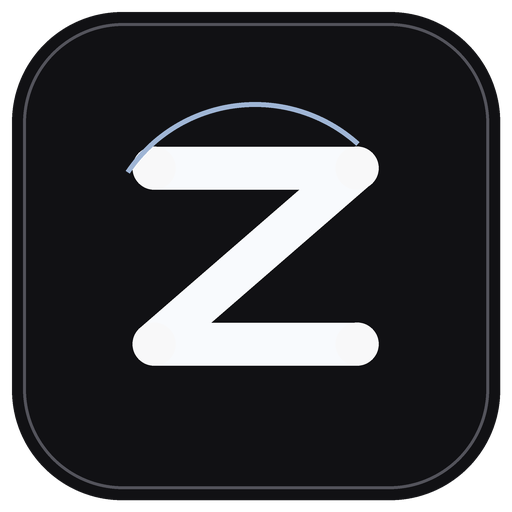

<p align="center">
  
</p>

<h1 align="center">Zenix Music Player</h1>

<p align="center">你的音乐，自成宇宙。</p>
<p align="center">桌面与移动端音乐播放器 · v1.0.0 首版</p>
<p align="center"><a href="./LICENSE">GPL-3.0</a> · Electron / React / TypeScript · 自定义音乐源</p>

<p align="center">
  <a href="#项目简介">项目简介</a> ·
  <a href="#核心能力">核心能力</a> ·
  <a href="#获取与使用">获取与使用</a> ·
  <a href="#本地开发">本地开发</a> ·
  <a href="#致谢与参考项目">致谢与参考项目</a> ·
  <a href="#许可证">许可证</a>
</p>

## 项目简介

Zenix 是以歌曲贴纸、个人空间和桌面歌词为主要体验的 Windows 桌面音乐播放器。支持用户导入自定义音乐源，搜索并播放歌曲；本地音乐保留为离线与备用入口。

界面布局、贴纸展开和切歌交互参考 [Folia Major](https://github.com/chthollyphile/folia-major)，音乐源接入参考 [LX Music Desktop](https://github.com/lyswhut/lx-music-desktop) 的自定义源协议与相关实现。个人主页结合用户提供的卡片页面设计，在 Zenix 中集成个人信息、歌单和外观管理。

项目使用第三方框架和组件，并在 AI 辅助下开发。感谢为界面体验、音乐源兼容、动画渲染与音频处理提供参考和支持的开源项目，具体关系见下方致谢。

## 核心能力

| 模块 | 当前实现 |
| --- | --- |
| 歌曲贴纸空间 | 按搜索结果或当前歌单展示对应数量的贴纸；支持不同尺寸、拖动浏览、点击聚焦、展开切歌和窗口内全屏展示。 |
| 个人主页 | 可编辑个人名片；环绕卡片进入喜欢、收藏、历史、歌单、本地曲库和播放器设置；支持背景及卡片封面个性化。 |
| 音乐源管理 | 导入 Zenix 源包、源文件夹、兼容的 `.js` 脚本或 HTTP / HTTPS 地址；支持预览、启停、排序、更新与移除。 |
| 搜索与顺序回退 | 顶部靠近触发玻璃搜索条；搜索可聚焦结果贴纸；播放按源接入顺序回退，并根据音质偏好尝试可用资源。 |
| 本地音乐 | 导入文件夹或音频文件，读取歌曲信息、时长与封面；支持本地索引及 M3U 歌单导入、导出。 |
| 播放与缓存 | 队列、上一首/下一首、随机、循环、进度拖动、音量和系统媒体键；完整音频缓存存在时优先从本机播放，本地歌曲可离线使用。 |
| 收藏与歌单 | 喜欢、收藏、去重后的近期历史和自定义歌单保存在本机；播放队列的移除操作与库存删除分开。 |
| 歌词 | 读取本地内嵌或同名歌词文件；音乐源目录可补充在线歌词；贴纸歌词支持浏览、跳转和自动回到当前句。 |
| 桌面 LRC | 独立透明歌词窗口，至少三句歌词，横向/纵向布局、字体与颜色调整、拖动预览、定位播放、锁定及召回主窗口。 |
| 个性化与音效 | 图片或视频背景按场景调整显示；Lottie 开屏动画；进入、取消、滑动三类音效，各五种方案，可调整或关闭。 |

以上为当前代码已集成的功能范围，开发版已完成本轮用户测试。项目未接入账号或登录系统。

## 获取与使用

### 首版 v1.0.0

三端公开版本保持 [v1.0.0](https://github.com/17hwliao/Zenix/releases/tag/v1.0.0)。修补完成后替换该稳定版的三端工件，并同步标签与源码；安装包文件名用修订号区分，移动端内部 build 单调递增。只有作者与测试人员共同确认可发布后，才递增公开版本号。当前移动端修订为 r8，Android / iOS build 8；Windows 保留 r7。

| 平台 | 发行内容 | 安装与更新 |
| --- | --- | --- |
| Windows x64 | Zenix-Setup-1.0.0-r7-x64.exe | NSIS 安装包，保留用户资料；未提供受信任代码签名证书，当前安装包为未签名状态，系统可能提示未知发布者。 |
| Android | Zenix-Android-1.0.0-r8.apk | 正式发行密钥签名 APK，后续沿用同一密钥覆盖更新。旧 Debug 测试包不能直接覆盖，迁移前请保留原数据。 |
| iPhone / iPad | [Zenix-iOS-1.0.0-r8-unsigned.ipa](https://github.com/17hwliao/Zenix/releases/download/v1.0.0/Zenix-iOS-1.0.0-r8-unsigned.ipa) | iOS 15+、ARM64 真机 IPA；未签名，须自行签名侧载，不能直接点击文件安装。尚无 TestFlight / App Store 发行。 |

同页提供 SHA256SUMS-1.0.0-r8.txt 校验文件，以及 GitHub 自动生成的完整源码归档。源码和安装包不包含用户音乐、缓存、个人资料、源脚本或签名私钥。三端打包不代表已完成所有真机功能验收，构建记录与限制见 [首版说明](docs/releases/v1.0.0.md)。

### 应用更新与专用源入口

Windows / Android 校验签名更新清单与安装包，确认后安装；iOS 提供 TestFlight / App Store 更新入口。首版 Android 提供正式更新通道；Windows 自动安装需后续配置受信任代码签名证书，iOS 更新需先建立 Apple 发行渠道。现阶段 Windows 手动下载安装；iOS 真机 IPA 由使用者自行签名侧载，更新也需沿用自己的签名身份。具体步骤见 [自动更新与签名说明](docs/automatic-updates.md)。

音乐源支持分享包文件与 HTTPS 分享链接，可保存自己的专用源入口；软件不附带源包。平台开发说明：[Android](docs/android.md)、[iOS](docs/ios.md)。

稳定版移动端 r8 补齐金卡触摸捕获与后层取回抓取区，统一音源包、脚本与多脚本 ZIP 批量导入；r7 集成 Android / iOS 输入法遮挡修补、金卡上抛、环绕卡片密度、分享 ZIP 直接导入与页面过渡；PC 首页滚轮恢复页面上下滚动。说明见 [稳定版](docs/releases/v1.0.0.md) 与 [移动端修补记录](docs/releases/v1.0.1-mobile-fixes.md)。

### 首次使用

1. 启动后可选择图片或视频作为个人背景，也可以跳过，之后在个人空间中更换。
2. 点击中央名片编辑个人资料和卡面，或通过环绕卡片进入播放器设置。
3. 在“播放器设置 → 音乐源”导入自己的源并启用；也可从主页导入本地歌曲作为离线备用。
4. 将鼠标移到窗口顶部的搜索触发区域，输入关键词；按回车或点击放大镜直接进入搜索结果贴纸；在搜索面板外点击空白区也会显示当前结果。点击歌曲后开始播放。
5. 从喜欢、收藏、历史或自定义歌单进入音乐空间时，贴纸按该列表的实际歌曲数量展示。直接进入音乐空间时显示近期播放记录。

### 音乐源与音质

支持 Zenix 完整源协议及兼容的自定义 `.js` 脚本。可以导入文件、Zenix 源文件夹或 HTTP / HTTPS 地址；导入后查看源选项，选择搜索平台、音质，管理启停、顺序和更新。

播放时按配置顺序尝试音乐源，每个源根据音质偏好尝试可用资源，再回退到下一个源；全部尝试失败后提示错误。更新脚本不改变原接入顺序。搜索、播放和歌词能力取决于所安装源的实现，搜到歌曲不保证对应播放地址一定可用。

**软件不捆绑音乐源脚本、歌曲或开发者个人配置，用户自行配置音乐源。** 当前开发版仍提供测试入口按钮；这些是用户主动导入的入口，不是默认已安装的源。具体发行清单见 [发行配置建议](docs/distribution-config.md)。

### 本地音乐、歌词与歌单

- 本地音频支持 MP3、FLAC、M4A、WAV、OGG、Opus 和 AAC，实际播放还取决于运行环境的解码能力。
- 可读取内嵌歌词及同目录同名 `.lrc`、`.vtt`、`.ttml`、`.qrc`、`.yrc`、`.krc` 文件；不同格式的基本时间轴与内容解析以当前实现为准。
- 在线曲目可通过源或目录适配器补充封面和歌词；没有可用歌词时显示空状态。
- 喜欢、收藏、历史与自定义歌单保存在本机；播放队列中的移除只影响当前队列，库存删除在歌曲管理界面进行。本地 M3U 歌单可导入、导出。

### 贴纸、歌词与个人空间

贴纸支持鼠标浏览、点击聚焦和窗口内全屏展开。歌词可滚动预览、点击跳转；停止操作后自动回到当前播放句。播放条提供进度、喜欢、收藏和添加歌单等操作。

桌面歌词以独立透明窗口显示三句歌词，支持横竖布局、字体与颜色调整、顶部拖动、歌词预览及定位播放。鼠标离开时收起操作区，锁定后减少对办公点击的干扰；房子按钮可以召回主窗口。

悬停操作层采用边缘缓冲与延迟收起，拖动时保持展开；调整歌词窗口大小使用右下角的小拖动柄。窗口采用高置顶层级，并在显示、主窗口召回和可见状态下维持顺序，不抢占其他应用的键盘焦点。

个人主页的卡片区域用于转动环绕卡片，卡片区域外可上下滚动页面；下滑按钮进入歌曲管理区域。中央名片支持编辑和向上拖动切换前后层，其他卡片悬停时恢复色彩。背景、卡面封面和三类交互音效可按个人喜好调整。

PC 右上角的放大按钮进入原生全屏，覆盖任务栏区域；再次点击恢复原窗口状态。F11 可随时切换全屏，主页没有打开面板时也可按 Esc 退出全屏。

### 数据保存与缓存

配置与曲库保存在本机应用用户数据目录。本地歌曲主要保存文件索引；喜欢、收藏、历史和歌单保存曲目信息。目前仅提供自动音频缓存，不提供主动歌曲下载。完整缓存可用时再次播放优先从本机读取；清除缓存不会删除歌曲库存和导入的本地音乐文件。

自动缓存默认上限 1 GiB，可调整为 512 MiB、1 GiB、2 GiB 或 5 GiB；超过容量时优先淘汰较久未访问的内容，30 天未访问的缓存可清理。缓存不是永久歌曲备份。

个人名片及部分外观偏好存放在 Local Storage 中。当前没有统一配置导出和云同步功能；详细位置、备份范围及发行默认值建议见 [配置与存储说明](docs/distribution-config.md#当前配置存放位置)。

## 本地开发

需要 Windows、Node.js 22.12 或更新版本，以及 npm。

```powershell
npm ci
npm run build
npm start
```

开发模式：

```powershell
npm run dev
```

开发模式同时启动 Vite 与 Electron。本地生产预览使用 `npm run build` 后的产物。

### Windows 安装包

```powershell
npm run package:win
```

输出到 `release/`。使用 electron-builder 的 NSIS 安装器，目标为 Windows x64，打包命令禁止自动发布。`npm run package:dir` 生成未安装的应用目录。文件范围由 `electron-builder.yml` 的白名单控制，用户数据不进入安装包；许可证与通知位于安装目录的 `resources/`，Electron 与 Chromium 的通知保留在安装根目录。

如需生成桌面启动快捷方式，在项目根目录运行：

```powershell
powershell -ExecutionPolicy Bypass -File .\scripts\Create-DesktopShortcut.ps1
```

## 文档与工程说明

界面使用 React、TypeScript 与 Vite，桌面端使用 Electron；主进程负责文件、曲库、窗口、源请求、音频缓存，界面通过预加载接口调用。源脚本使用独立宿主运行，播放请求由应用代理。

| 技术类别 | 当前技术 |
| --- | --- |
| 桌面与界面 | Electron 43.7.5、React / React DOM 19.3.0 |
| 语言与构建 | TypeScript 5.9.3、JavaScript、HTML/CSS、Vite 7.3.6 |
| 动画与背景 | Framer Motion 13.4.4、lottie-web 5.13.0、Paper Shaders 0.0.80、CSS 3D / Web Animations API / WebGL |
| 图标与音频 | Lucide 1.48.0、music-metadata 11.16.1、HTMLAudioElement、Media Session API |
| 通信与存储 | Electron IPC、Fetch、Range 媒体代理、JSON、Local Storage 和本机磁盘缓存 |

版本按当前锁定依赖记录，完整职责划分与开发工具见 [技术栈](docs/technical-stack.md)。

```text
src/              界面、播放器状态、歌词与交互
electron/         桌面主进程、预加载接口、曲库与音乐源
electron/runtime/ 源宿主、网络、媒体代理和缓存模块
assets/           图标、动画相关资源与合成音效
scripts/          本地启动辅助与性能采样脚本
docs/             协议、配置和工程说明
licenses/         第三方许可证与通知原文
```

- [音乐源接入设计](docs/custom-source-design.md)
- [完整技术栈与桌面歌词交互实现](docs/technical-stack.md)
- [Zenix 自定义源协议](docs/zenix-source-protocol.md)
- [性能优化、模块划分与内存采样](docs/performance-architecture.md)
- [回归测试、移动贴纸优化与内存对照（2026-10-03）](docs/regression-memory-2026-10-03.md)
- [发行配置与用户首次配置建议](docs/distribution-config.md)
- [可转发音乐源包与批量导入](docs/source-sharing.md)
- [第三方组件与来源说明](THIRD_PARTY_NOTICES.md)

应用设置、曲库、歌单、历史及缓存保存在本机用户数据目录。音乐源脚本通过独立沙箱窗口运行；只有用户安装并启用的源参与搜索与播放。主程序仓库记录预设入口，不内嵌这些外部源的脚本正文。

## 致谢与参考项目

感谢以下项目的作者、维护者与贡献者。参考与使用范围概述如下，版本、许可原文及更详细的来源记录见 [第三方说明](THIRD_PARTY_NOTICES.md)。

### 界面与功能参考

| 项目或资源 | 参考内容 |
| --- | --- |
| [chthollyphile/folia-major](https://github.com/chthollyphile/folia-major) | 参考窗口布局、玻璃控件、贴纸展示、聚焦切歌和交互动效 |
| [lyswhut/lx-music-desktop](https://github.com/lyswhut/lx-music-desktop) | 参考自定义音乐源协议、脚本接口和音乐目录适配相关代码与实现思路 |

### 直接使用的运行组件

| 项目 | 用途 | 许可证 |
| --- | --- | --- |
| [electron/electron](https://github.com/electron/electron) | 桌面窗口、进程、IPC 与系统接口。 | MIT；其二进制内含其他组件的独立许可。 |
| [React](https://github.com/react/react) | React / React DOM 界面组件与渲染。 | MIT |
| [motiondivision/motion](https://github.com/motiondivision/motion) | Framer Motion 页面与控件动效。 | MIT |
| [airbnb/lottie-web](https://github.com/airbnb/lottie-web) | 实际调用 Lottie 播放器渲染开屏动画。 | MIT |
| [paper-design/shaders](https://github.com/paper-design/shaders) | 实际使用 MeshGradient、Dithering 及 React 着色器组件。 | Apache-2.0 |
| [lucide-icons/lucide](https://github.com/lucide-icons/lucide) | 窗口、音乐、歌词和管理功能的图标。 | ISC |
| [Borewit/music-metadata](https://github.com/Borewit/music-metadata) | 读取本地音频元数据及内嵌封面、歌词。 | MIT |

开发与构建还使用 [Vite](https://github.com/vitejs/vite)、[vite-plugin-react](https://github.com/vitejs/vite-plugin-react)、[TypeScript](https://github.com/microsoft/TypeScript)、[DefinitelyTyped](https://github.com/DefinitelyTyped/DefinitelyTyped)、[concurrently](https://github.com/open-cli-tools/concurrently)、[cross-env](https://github.com/kentcdodds/cross-env) 和 [wait-on](https://github.com/jeffbski/wait-on)。开发依赖与发行包内的运行组件分开记录。

### 外部音乐源与入口资源

感谢以下音乐源入口维护项目和各脚本原作者。入口由开发者自行收集用于本机使用与兼容调试，发行时不捆绑源脚本或个人歌曲，下表为开发来源记录。

| 项目或入口 | 当前预设涉及的资源 | 使用方式 |
脚本归各自作者，其许可证与服务要求独立适用。具体入口与许可状态见 [第三方说明](THIRD_PARTY_NOTICES.md#外部音乐源与脚本入口)，列出入口不代表保证服务长期可用。

目录适配器还访问酷我、酷狗、网易云音乐、QQ 音乐和咪咕音乐的在线接口，用于歌曲检索、封面及歌词补充。这些属于外部服务接入，不代表上述平台参与开发、认可本项目或授予内容再分发许可；接口范围见 [第三方与外部服务说明](THIRD_PARTY_NOTICES.md#外部目录与内容服务)。

### 素材与生成工具

开屏使用 Lottie 动画数据，图标通过 [Pillow](https://github.com/python-pillow/Pillow) 绘制，交互音效通过 Python 标准库合成。感谢相关工具作者；用户照片、视频、歌曲和封面属于相应提供者或权利人。


## 开发与贡献

欢迎提供可复现的缺陷说明、交互建议和代码改进。报告问题时请注明版本、Windows 版本、复现步骤和现象；音乐源问题可说明脚本版本及失败阶段，日志和截图应去除访问密钥、联系方式与个人文件路径。

提交改动请说明影响范围及验证方式，保留上游版权与许可证通知，并注明新增第三方代码或资源的来源。贡献者应确保有权提交相应内容，项目自有代码的贡献按下述 GPL-3.0 条款提供。

当前已完成本轮用户测试和 Windows 安装包制作，继续接受交互、性能与兼容性反馈。Android 已提供预览包；统一配置导出、Linux/macOS 发行包及跨设备同步暂未提供。

## 内容与服务说明

Zenix 提供音乐源接入和播放器功能，未接入账号与登录系统。源服务、平台接口和媒体内容独立于本项目，用户应使用有权访问的内容，并遵守相应服务要求。代码开源许可不等于歌曲、歌词、封面或其他在线内容的授权。

软件按许可证约定提供，不作适用性或持续可用性保证。此处说明不增加 GPL 之外的使用限制。

## 许可证

Copyright (C) 2026 17hwliao。

**Zenix 自有且开发者有权授权的代码采用 GNU GPL 第 3 版（`GPL-3.0-only`）。** 完整条款见 [LICENSE](LICENSE)。可按该许可证使用、修改和分发；分发时须保留适用通知，并按许可证要求提供对应源码。

第三方组件、参考项目、外部脚本与素材保留各自许可证及版权声明。Folia Major 采用 AGPL-3.0，LX Music Desktop 采用 Apache-2.0；参考与使用范围见 [致谢](#致谢与参考项目)，依赖许可证与通知见 [第三方说明](THIRD_PARTY_NOTICES.md) 及 [`licenses/`](licenses/)。
